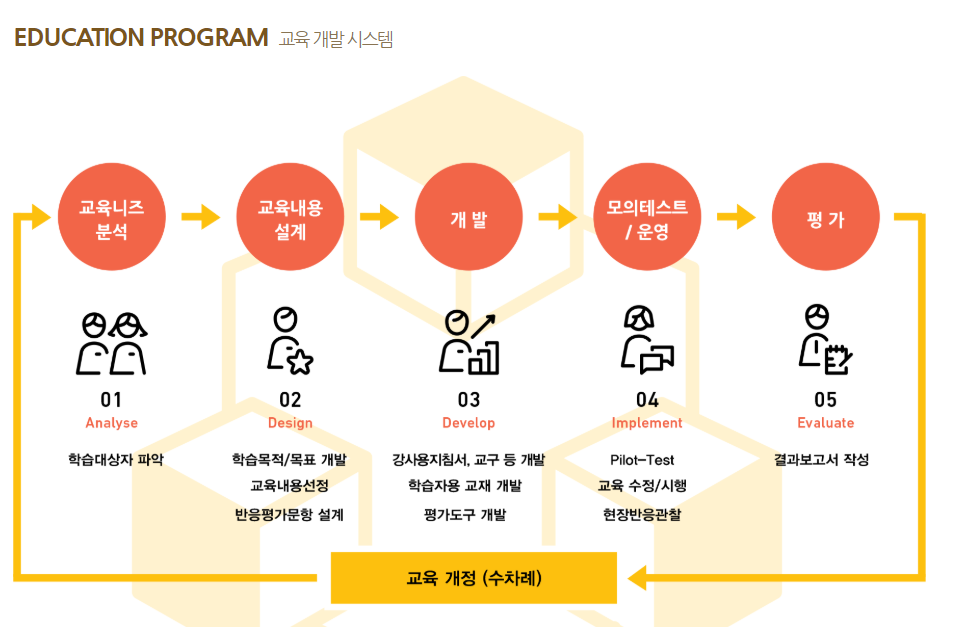

# 설리번과 비교해볼 수 있는 기존 플레이어 사례
## 1. 소셜 문제를 해결하려는 교육 단체(이해관계자가 involve된 형태)
  - 국제아동인권센터 http://incrc.org/
    - 모든 아동이 권리, 존엄성, 진실성을 존중 받을 수 있도록 옹호 활동을 하는 단체이다. 인권 보호 NGO이지만 진행하는 사업 중에 아동관련 종사자와 전문가들에게 교육훈련이 있다. 아동인권옹호전문가(CRA) 양성과정, 찾아가는 아동인권교육, 지자체 강사양성과정 등의 사업을 진행하고 있다. 
    - 그 중 아동인권교육 사업에 초점을 두었다. 찾아가는 아동인권교육 사업은 해당 교육을 받고자 하는 기관의 신청을 통해 진행하는 사업이다. 이들은 신청 대상이 아동인권교육에 관심만 있다면 맞춤형 교육 내용을 구성하여 찾아가 교육한다.
    - 참고링크 http://incrc.org/go_childrights/
    - vs. 설리번
      아동인권교육 사업은 소셜 이슈(아동인권보호) 하나를 목표로 활동하며 대상의 제한없이 교육 사업을 펼치고 있다. 특히 교육 대상에 맞춤화된 교육을 구성해 실시한다는 점이 눈여겨 볼 점이다. 인권교육 사업은 해당 교육을 필요로 하는 기관에서 신청하기 때문에 맞춤화된 구성이 가능하다. 그러나 설리번은 해당 '기술'에 관심이 있는 사람들이 '모이기' 때문에 대상의 환경, 이해도, 경험 등이 다 달라 맞춤화된 교육 구성에 어려움이 있다.
  - Food For Change http://foodforchange.or.kr/whoweare
    - 올바른 식문화의 즐거움과 사회적 가치를 알리는 식생활 교육을 통해 건강하고 지속가능한 식문화를 실천하는 비영리 사단법인이다. 다양한 식생활 교육을 기획하고 실천한다. 
    - 그들의 교육 개발 시스템을 인상깊게 보고 가져왔습니다.
      
    - 이 단체에서 진행하는 바른먹거리 캠페인 교육 중에 '동물복지'에 관한 교육이 있어 참고하였습니다. http://foodforchange.or.kr/animal_welfare
       대상은 초등학교 5~6학년인데, 자발적 실천과 이해가 가능한 연령대이기 때문에 선정했다고 합니다. 단순한 기술에 대한 흥미, 관심도에 따른 대상 선정보다 연령대별 특성을 고려한 선정도 적절하다고 생각이 들었습니다.

         
## 2. 소셜 문제를 이해관계자 자체에 involve가 어떤 형태로든 되는 단체(교육 외)
  - The Red Cross Society https://kr.icrc.org/
    - 국제 적십자사는 1863년 10월 26일에 설립된 국제 단체로 Jean Henry Dunant가 설립하였다. 전쟁 중이던 Solferino로 여행을 갔던 그가 수많은 사람들이 부상을 당하고 죽어가는 모습을 보고 충격에 휩싸였다. 그는 스위스로 돌아가 전쟁의 희생자들을 보호해야한다는 내용의 책을 집필하였다. 이 책에서 그는 구호기관 설립과 국제 협약 체결을 제안했고, 각고의 노력 끝에 제네바 협약 체결 후 국제 적십자 위원회로 활동을 펼치게 되었다.
    - vs. 설리번
      적십자회는 그들의 이해관계자가 뚜렷하다. "전쟁 등의 무력 분쟁에 의한 희생자들을 보호하는 것" 해결이 필요한 사회문제 자체가 정확해서 그런 게 아닐까 하는 생각이 든다. 이에 반해 설리번 프로젝트는 개인이 생각하는 사회문제를 해결하기 위한 도구로써 기술을 교육하는 것이기 때문에 이해관계자 설정에 있어서 모호한 면이 있는 것 같다. 학생모의재판처럼 교육 주제를 하나의 소셜문제로 설정하고 이를 해당 기술로 해결해나가는 방식은 어떨까 하는 생각도 든다. 
  - 작은농부커피((주)샤인위드컴페니언) http://smallfarmercoffee.com/
      카메룬 작은 농부들의 자립을 위해 활동하는 단체이다. 수출에 대부분을 의지하는 카메룬 커피 시장에서 수출회사가 불공정하게 독점, 가격 결정을 하면서 농부들은 어려움을 겪고 있다. 이를 해결하기 위해 산지별 농부들과 직접 연대해 가공시설, 창고를 지어주고 직거래로 수매하는 활동을 펼치고 있다.
       
## 3. social 이야기나 키워드를 내포하는 기술교육단체
  - 한국해양과학기술원 http://www.kiost.ac.kr/kor.do
      해양연구기관으로서 기후변화 대응, 재해, 재난으로부터의 안전과 같이 새로운 임무 수행을 위해 연구 성과 창출, 해양과학기술 확보에 힘쓰고 있다. 연구 사업과 동시에 교육 사업을 함께하고 있는데, 학위 취득 과정, 해군 교육과정, 과학교사 교육과정, 청소년 교육과정을 운영하며 해양과학 인재를 양성하고 있다. 

## 4. 기술교육 기획자 양성 단체 프로그램 
  - edwith > boost course https://www.edwith.org/boost-course/intro
    - 부스트코스는 개발자 양성을 목표로 해당 직업에 필요한 지식들을 학습할 수 있게 해주는 온라인 교육 프로그램이다. 실무자의 강의를 바탕으로 실전 프로젝트를 진행하고, 현업 전문가들이 멘토링을 해주면서 실력을 쌓아나갈 수 있다. 성공적으로 코스를 완주하면 기업 연계를 해주기도 한다. 예로 웹프로그래밍 코스는 네이버의 예약 서비스를 구현해보는 것을 목표로 웹에 대한 기본 상식부터 백엔드, 프론트엔드까지 동영상 강의를 진행한다. 회차마다 미션이 주어지고, 유료 서비스로 현업 전문가들의 코드 리뷰를 받아볼 수 있다.
